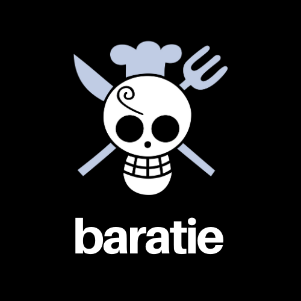

<p align="center">
  
</p>

## <a name='TOC'>🐼 Summary</a>

* [Rules](#rules)
* [Overview](#overview)
* [Story](#story)
* [Postlude](#postlude)
* [Bonus](#bonus)
* [Credits](#credits)

## <a name='overview'>🦊 Rules</a>

Hi, here are some rules to carry out this story oav;

* You **MUST** create a git repository named `ts-baratie`
* You **MUST** create a file called `.author.json` with your fullname

```sh
~/ts-baratie ❯❯❯ cat -e .author.json
{
  "fullname" : "Tim Berner Lee"
}$
```

> Of course, you can talk about the subject with other developers, peer-learning is
> the key to be a better developer. Don't hesitate to ask questions or help people on slack.

> Don't forget, there is no useless question :-)

* You **MUST** return the project on Tuesday March, 31 at 23:42 pm by sending an MP on slack with the link of your github repo.

Your repository **MUST** contain the totality of your source files, but no useless files (node_modules, temp files, log files,...).

## <a name='overview'>🐱 Overview</a>

The purpose of this project is to make you realize a simulation of a restaurant, which is composed of the reception that accepts new commands, of several kitchens, themselves with several cooks, themselves cooking several dishes.

You will learn to deal with various problems, including load balancing, process and thread synchronization and communication.

Before you get started, should take some time to read up on the following tools you’ll need to use :
- [Processes](https://nodejs.org/api/child_process.html)
- [IPC aka Inter-processcommunication](https://en.wikipedia.org/wiki/Inter-process_communication)

## <a name='story'>🐨 Story</a>

### = Prelude

Here is an overview of the expected architecture:


### = The Reception

The reception **MUST** be started using the command line the following way:

```sh
~/ts-baratie ❯❯❯ yarn start 2 5 2000
```

* The first parameter is a multiplier for the cooking time of the dish.
* The second parameter is the number of cooks per kitchen (**detailed below**)
* The third parameter is the time in milliseconds, used by the kitchen stock to replace ingredients (**detailed below**)

The reception **MUST** be an interactive shell with at least the following actions:

- Commands of a dish by the user though command line, for example "Katsudon XXL x5" (**detailed below**)
- Displays the kitchens status,including the current occupancy of the cooks, as well as theirs stocks of ingredients using the `status` command.

Dish ordering **MUST** respect the following grammar:

```txt
S := TYPE SIZE NUMBER [; TYPE SIZE NUMBER]*
TYPE := CHARACTER+
SIZE := S|M|L|XL|XXL
NUMBER := x[1..9][0..9]*
CHARACTER := [a..zA..Z]
```

Example with a valid grammar:<br />
`Takoyaki M x2; Udon XL x1; MatchaCookie S x1`

> It is not because the grammar is very simple that your parser may be too basic! #sexyCode

The reception **MUST**:

* Be able to place more orders when the program is running. The program **MUST** be able to adapt, allocate dish by dish to kitchens when receiving an order .
* When all the kitchens are saturated, it **MUST** create a new one (do a fork as explained later.)
* Always allocat dish to kitchens so that the occupancy is as balanced as possible. You **MUST** not have
one kitchen with all the dishes and the others not doing anything!

When an order is ready, the reception **MUST** display the information to the user and keep a record.

> A log file should be a good idea...

### = The Kitchen

Kitchens are child processes of the reception. They are created progressively, when needed. 
Kitchens possesses a predetermined number of cooks that is defined when the program is started.

Cooks **MUST** be represented by threads. When a cook does not have a task, he **MUST** yield. Cooks start to work one after the other, when order arrives.

> Take a look at ´worker_threads´

These threads **MUST** be scheduled by a Thread Pool local to each kitchen.

You **MUST** propose an object encapsulation for each of the following notions:

* **Processes**
* **Threads**
* **Mutex**
* **Conditional variables**

> These 4 abstractions represents a very important part of the points available in the scale. You should execute this encapsulation intelligently...

Moreover :

* Each kitchen **CAN'T** accept more than 2 * N dish, (meaning dish to cook, or dish waiting to be cooked) with N being the number of Cooks. A kitchen MUST refuse any command of dish over this number.
* The reception **MUST** open a new kitchen if the existing kitchen can’t accept any more order.
* Cook love their work and are accountable for it. A cook **WILL NOT** prepare more than one dish at a
time!
* Kitchens communicate with the reception thanks to an IPC (choose the one to use wisely).
* You **MUST** propose an object encapsulation for the choosen IPC you’re using.
* If a kitchen doesn’t work fo more than 5 seconds,this kitchen **MUST** close.
* A kitchen possess a stock of ingredients that contains, when created, 5 units of each ingredient. The
stock regenerate 1 units of each ingredients every N seconds. N being the number passed in the com- mand line at the start of the program.

> Creation and destruction of kitchen means that there are communication problems that need to be sorted out and watched over very closely...

### = The Dish

As explained earlier, the reception must allocate order between kitchens, dish by dish.

For example if one command is about 7 takoyaki, these takoyaki will be dispatched between 7 different kitchens (if there are 7 kitchen running at this point in time).

When the information is flowing through the choosen IPC, information about the command and dishes return **MUST** be serialized. You **MUST** use the following definition of value:

```typescript
enum DishType {
  Takoyaki = 1,
  Katsudon = 2,
  Udon = 4,
  Ramen = 8
  MatchaCookie = 16
};

enum Dishsize {
  S = 1,
  M = 2,
  L = 4,
  XL = 8,
  XXL = 16
};
```

Within communication, dish are passing through, using the form of an opaque object type of your choice.
It **MUST** be possible to use operators pack and unpack on this type to serialize or to unserialize data

You **MUST** manage the follwing dishes:
* Takoyaki: Contains octopus and soja sauce. Baked in 1 sec * multiplier.
* Katsudon: Contains rice, pork, eggs .Bakedin 2 secs * multiplier.
* Udon: Contains noodle, pork, eggs. Bakedin 2 secs * multiplier.
* Ramen: Contains noodle, chicken, eggs. Bakedin 2 secs * multiplier.
* MatchaCookie: Contains dough, matcha, chocolate and chief love. Baked in 4 secs * multiplier.

> You must ask yourself as early as possible how to represent time. This can save you lots oftime...

## <a name='bonus'>🦄 Bonus</a>

I know you love that, well you can in bulk:

* Add graphical version of the reception
* Being able to add new dish very simply (abstraction?)

## <a name='credits'>🐵 Credits</a>

Craft with :heart: in **Paris**.